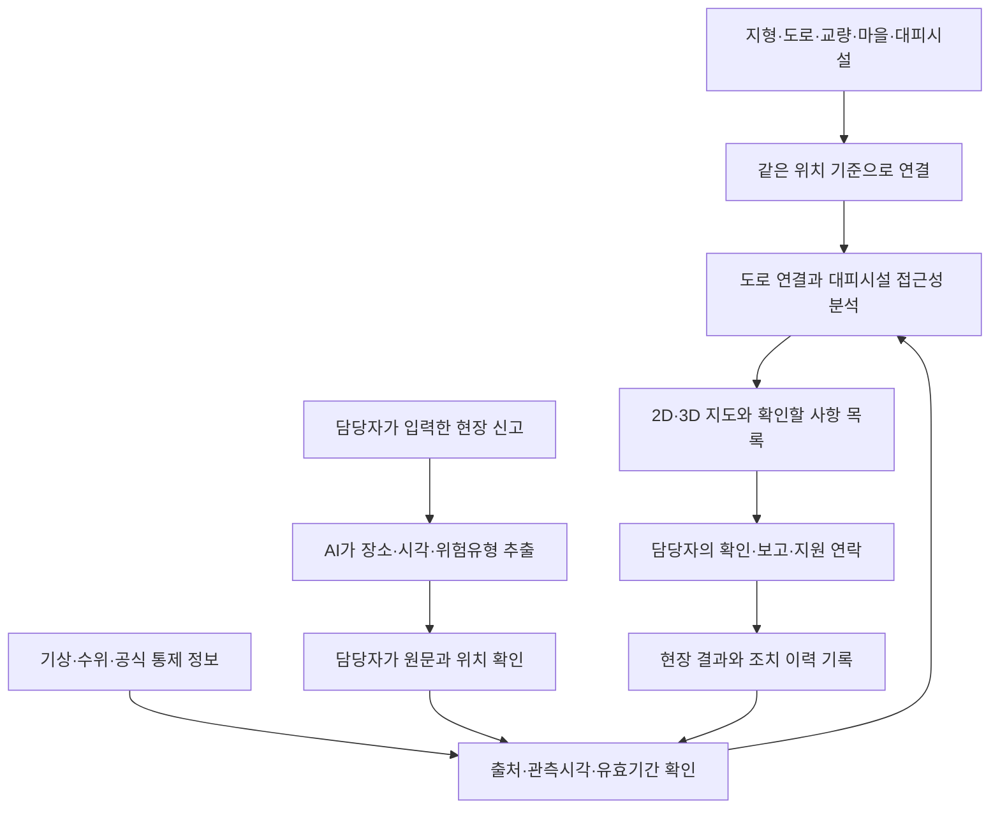

# 운산면 원평소하천 주변 마을의 침수·고립 대응 지원

작성일: 2026-09-30  
용도: 「지역 현안 해결 솔루션 챌린지」 현안 정의·핵심 제안 검토안  
핵심 사용자: 운산면 행정복지센터에서 호우 비상근무를 맡은 재난업무 담당자 1종

## 제안의 중심

**호우 비상근무 담당자가 하천 주변 마을의 도로 통제, 대피시설 운영, 현장 확인 결과를 같은 지도에서 대조하고, 대피 지원을 위해 우선 확인할 마을과 경로를 판단하도록 돕는다.**

3D 지도는 지형과 교량·진입도로의 관계를 설명하는 화면이다. 핵심 기능은 도로 연결 상태와 대피시설 접근성의 분석, 정보의 출처·시각 관리, 현장 확인 결과의 반영이다.

이 문서는 공개자료에 근거한 설계안이다. 가상 페르소나와 이용 장면은 실제 직원 인터뷰나 실제 재난 당시의 증언이 아니다. 기존 업무에서 정보 대조에 드는 시간, 사용 중인 내부 시스템의 기능, 주민별 지원 수요는 현장 조사로 검증할 가설이다.

## 1. 페르소나 하나: 운산면 호우 비상근무 담당자

| 항목 | 구체적 설정 |
|---|---|
| 이름 | 김 주무관 — 설명을 위한 가상 인물 |
| 소속·역할 | 운산면 행정복지센터의 재난 관련 업무를 수행하며, 호우 시 현장 상황 취합·확인과 대피 지원 연락을 맡는 담당자 |
| 담당 지역 | 운산면. 첫 실증은 원평소하천 주변 원평리·고풍리의 확인된 피해구역과 연결도로로 한정 |
| 이용 시점 | 호우특보에 따른 비상근무, 침수·도로 통제 신고 접수, 대피시설 개방 확인, 다음 근무자에게 상황 인계할 때 |
| 완수할 일 | 어느 마을을 우선 확인할지, 어느 대피시설로 연결 가능한지, 누구에게 확인·지원 요청을 했는지 정리 |
| 필요한 판단 | 시설까지의 거리 외에 도로 통제·교량·경사·현장 확인 시각을 함께 고려한 접근성 판단 |
| 사용 환경 | 사무실 PC를 주 화면으로 사용. 전화로 들어온 현장 내용을 구조화하고, 필요한 경우 모바일로 확인 결과 열람 |
| 설계상 제약 | 제보가 불완전하거나 같은 장소를 다른 지명으로 부를 수 있음. 도로·대피시설 상태가 바뀔 수 있음. 실제 빈도는 조사 필요 |
| 권한의 경계 | 확인·보고·지원 업무를 돕는 도구. 공식 대피명령이나 구조대 출동 권한을 이 가상 인물에게 임의로 부여하지 않음 |
| 성공한 상태 | 근거와 최신 확인 시각이 포함된 마을별 상황표를 만들고, 미확인 사항과 연락·조치 결과를 빠짐없이 인계 |

**가상 요구 문장:** “물이 찬다는 연락을 받으면, 영향을 받는 마을과 대피소 연결 상태부터 확인하고 싶다. 아직 확인하지 못한 정보도 분명하게 보였으면 한다.”

주민은 이 업무 개선의 수혜자다. 주민용 앱, 구조대용 관제, 시설관리자용 시스템을 별도 주사용자로 추가하지 않는다.

**이 페르소나를 선택한 이유:** 도로·교량 상태, 시설 개방 여부, 마을별 확인 결과를 대조해야 하는 업무를 하나로 묶을 수 있다. 신고를 정리하는 시간과 인계 누락을 측정할 수도 있다. 연령·성별·성격을 임의로 붙이는 것보다 업무, 장소, 이용 시점, 권한을 명확히 하는 데 집중한다.

직무 근거의 범위: [운산면 업무분장](https://www.seosan.go.kr/emd/selectEmployeeList.do?key=1913&searchDeptCode=2%7C45300710000)에는 토목공사·보수 등의 업무가, [서산시 안전총괄과 업무분장](https://www.seosan.go.kr/www/selectEmployeeList.do?key=2330&searchDeptCode=2%7C45303200000)에는 재난상황·예경보 관련 업무가 안내돼 있다. ‘운산면 호우 비상근무 담당자’는 설계를 위한 역할 명칭이며, 공개 업무분장에 있는 단일 정식 직책을 옮긴 것이 아니다. 실제 비상근무 편성과 확인·보고 권한은 실증 전에 확인한다.

## 2. 지역적 특성과 현안의 근거

### 2.1 대상 지역의 경계

- 행정적 대상: 충청남도 서산시 운산면.
- 우선 검토구역: 원평소하천 주변 원평리·고풍리와 해당 구역의 대피시설 연결도로.
- 최종 실증 경계: 침수흔적, 하천·도로 공간자료, 교량 현황, 지정 대피시설 자료를 대조해 확정한다.
- 두 리 전체가 침수됐거나 주민 모두가 고립됐다는 뜻은 아니다. 현재 확보한 자료는 하천 피해와 복구사업의 근거이며, 개별 도로의 단절 시간·정확한 침수 깊이까지 입증하지 않는다.

### 2.2 확인된 사실과 제안에 대한 의미

| 확인된 사실 | 지역·시점 | 제안에 대한 의미 | 출처 |
|---|---|---|---|
| 서산시가 2025년 7월 22일 호우 특별재난지역 6개 시군 중 하나로 우선 선포됨 | 서산시 전체, 2025년 사건 | 중앙정부가 인정한 피해지역이라는 배경. 운산면의 피해 규모나 전국 순위를 뜻하지 않음 | [대통령실 발표](https://www.korea.kr/briefing/presidentView.do?newsId=148950860) |
| 원평천 개선복구에 사업비 약 213억 원, 2028년 6월 완공 계획을 보고 | 서산시의회 2026-07-29 | 단기 응급조치 이후에도 하천 개선사업이 필요한 지역. 금액은 복구사업비이며 피해액이 아님 | [서산시의회 회의록](https://lib.scc.go.kr/minutes/mnts/cnts/mnt/mntsViewer.php?params=T3N1cjRwMXM2S3dqSzRPSmhFK3FOQT09) |
| 2026년 9월 보도에서 원평리·고풍리 주민대표가 복구사업 보상협의회에 참여. 하천·호안 약 6.88km, 교량 6개 신설 등 계획 | 원평소하천 사업, 2026-09-22 | 하천과 교량·마을 연결을 함께 검토할 구체적 근거. 사업계획을 현재 완료된 시설로 표시하면 안 됨 | [뉴시스의 서산시 발표 보도](https://mobile.newsis.com/view/NISX20260922_0003800746) |
| 운산면은 서부 평야와 동부 산간으로 나뉘며 농업·축산업이 이루어지는 지역으로 소개됨 | 운산면 전체의 지리적 특성 | 마을별 지형·하천·접근로를 함께 볼 이유가 있음. 원평리의 개별 도로 경사나 고립 위험을 이 설명만으로 확정할 수는 없음 | [서산시 운산면 지역특성](https://www.seosan.go.kr/welfare/contents.do?key=2436) |
| 31개 마을, 2,691세대, 4,953명 | 운산면 전체, 2025년 7월 말 | 여러 마을을 구분해 관리할 필요를 보여주는 규모. 시범구역 인구·피해인구·2026년 현재 인구와 구별 | [서산시 운산면 일반현황](https://www.seosan.go.kr/welfare/contents.do?key=2436) |

최신 시점 유의: 2026년 초 업무계획의 공사 규모·준공 목표와 2026년 하반기 발표가 다르다. 본문에는 위 하반기 자료를 사용했다. 보상·공사 진행률과 임시 통행 상태는 관리부서에서 별도 확인해야 한다.

### 2.3 제안서용 현안 정의

충청남도 서산시 운산면 원평소하천 주변은 2025년 집중호우로 하천 피해가 발생해 개선복구사업이 추진되는 지역이다. 이 지역의 호우 대응에서는 하천 위험뿐 아니라 주변 마을에서 대피시설로 이어지는 도로와 교량의 상태를 함께 확인해야 한다. 운산면 호우 비상근무 담당자는 현장 신고와 도로 통제, 대피시설의 개방 여부·수용 여건에 대한 확인 정보를 바탕으로 상황을 취합하고 지원 연락을 이어가는 사용자로 설정한다.

본 제안은 이 담당자가 ‘어느 마을을 우선 확인해야 하는지’, ‘통제 구간을 제외하면 대피시설과 연결되는지’, ‘확인되지 않은 사항이 무엇인지’를 근거와 함께 판단하는 과정을 개선한다. 구체적으로는 정보의 위치·시각·확인 상태를 맞추고, 도로 연결 관계에 변화가 생겼을 때 영향을 받는 마을을 표시하며, 연락·확인·지원 결과를 같은 기록에 남기는 업무를 지원한다.

공개자료는 피해와 복구 필요성을 뒷받침한다. 다만 이러한 정보 대조가 현재 얼마나 지연되는지, 기존 내부 시스템에서 어느 수준까지 지원되는지는 확인되지 않았다. 따라서 ‘행정이 대응하지 못했다’거나 ‘대피 시스템이 없다’고 단정하지 않고, 실제 담당자의 업무 관찰을 통해 개선할 지점을 검증한다.

## 3. 누가·어디서·언제 겪으며, 어떤 영향을 받는가

| 항목 | 이 제안에서 다루는 내용 | 증거의 성격 |
|---|---|---|
| 누가 | 호우 비상근무 담당자가 상황 확인·보고 업무를 수행. 주변 마을 주민이 그 결과의 영향을 받음 | 설계 페르소나 |
| 어디서 | 원평소하천 주변 피해구역, 마을 진입도로·교량, 지정 대피시설까지 이어지는 도로 | 세부 경계·시설 목록은 자료 확보 후 확정 |
| 언제 | 호우특보 전후부터 통제 해제까지. 특히 새 침수 신고, 통제 변경, 시설 개방·폐쇄, 근무 인계 시점 | 제안의 이용 상황 |
| 안전 | 도로 상태를 잘못 해석하면 통제 구간을 포함한 이동 계획을 세우거나 연결이 끊긴 마을을 놓칠 위험 | 가능한 영향. 지역 내 발생 건수는 미확인 |
| 건강 | 이동 지원이 필요한 주민의 대피 준비·돌봄 연계가 늦어질 가능성 | 가능한 영향. 지역 환자·취약주민 수를 임의로 추정하지 않음 |
| 시간 | 같은 장소 확인을 반복하거나 위치·시각이 다른 정보를 맞추는 데 시간이 들 수 있음 | 현장 측정할 가설 |
| 비용 | 중복 확인·재이동·잘못된 지원 배치가 발생하면 인력과 차량 운용 비용이 늘 수 있음 | 절감 금액은 산정 전 |
| 환경 | 침수로 발생하는 오염·폐기물은 지역 재난의 영향이지만, 이 서비스가 직접 줄였다고 주장할 근거는 부족 | 초기 성과지표에서 제외 |

### 이 지역에서 중요한 이유

1. **실제 호우 피해와 하천 개선사업이 확인된다.** 막연한 전국 재난 문제가 아니라 구체적 하천과 주변 마을을 대상으로 검증할 수 있다.
2. **교량과 하천을 함께 다루는 복구계획이 있다.** 시설 위치를 표시하는 데서 나아가 도로 연결 관계를 검토할 이유가 있다.
3. **복구사업의 진행에 따라 지도도 갱신해야 한다.** 공사계획과 현재 통행 상태를 구분해 관리하는 것이 필요하다. 실제 우회도로·공사 중 통제 여부는 별도 확인 대상이다.

### 방치할 때 예상되는 문제

정보의 확인 시각과 도로·시설 상태를 함께 관리하지 못하는 업무 공백이 현장 조사에서 확인될 경우, 같은 문의의 반복, 교대 시 미확인 사항 누락, 통제 구간을 포함한 이동 계획, 지원이 필요한 마을의 확인 지연으로 이어질 수 있다. 이는 검증할 위험 시나리오이며, 해당 지역에서 이미 같은 실패가 발생했다고 쓰지 않는다.

## 4. 현재 제도·서비스·시설과 남아 있는 과제

서산시에는 이미 정보를 관측·전달하고 재난에 대응하는 수단이 있다. 아래의 마지막 열은 각 기능만으로 충족되는지 확인해야 할 업무를 설명한다. 기존 내부 시스템에 해당 기능이 없다는 조사 결과는 아니다.

| 제도·서비스·시설 | 확인된 역할 | 이 제안에서 추가로 연결하거나 검증할 부분 |
|---|---|---|
| [서산시 재난안내문자](https://www.seosan.go.kr/www/contents.do?key=5033) | 신청자에게 기상·재난·안전 정보를 문자로 전달 | 정보 수신 이후, 특정 마을에서 개방된 대피시설까지 실제로 연결되는지 판단하는 업무 |
| [전화마을방송](https://www.seosan.go.kr/www/contents.do?key=10409) | 이용 마을에서 이장의 음성 내용을 주민 전화로 전달 | 마을별 확인 결과와 도로·시설 상태를 반영한 연락 내용 준비. 원평리·고풍리의 가입·운영 현황은 미확인 |
| [도시안전통합센터의 영상정보 업무](https://www.seosan.go.kr/www/contents.do?key=2751)·[강우량 안내](https://www.seosan.go.kr/www/contents.do?key=7217) | 영상정보와 강우 관측정보를 이용하는 기반 | 카메라 밖 구간, 관측값의 유효 범위, 면 담당자의 열람권한을 확인하고 현장 회신과 대조. 원평권역의 CCTV·센서 배치는 추가 확인 |
| [홍수위험지도](https://www.floodmap.go.kr/intro) | 조건별 침수 가능 범위를 이해하는 자료 | 지도 시나리오와 현재의 도로 통제·시설 개방은 별도 정보. 원평소하천의 자료 포함 여부부터 확인 필요 |
| [국민재난안전포털 대피시설 안내](https://www.safekorea.go.kr/idsiSFK/neo/main_m/res/acmdfcltyList.html) | 재난 시 활용할 시설 정보를 확인하는 통로 | 풍수해에 적합한 지정 여부, 실제 개방·진입 가능 여부, 수용 여건을 담당 기관과 확인. 마을회관이나 민방위 시설이라는 이유만으로 등록하지 않음 |
| [원평천 개선복구사업](https://lib.scc.go.kr/minutes/mnts/cnts/mnt/mntsViewer.php?params=T3N1cjRwMXM2S3dqSzRPSmhFK3FOQT09) | 하천·교량 등 물리적 기반을 개선하는 계획 | 공사 진행 중·완료 후 달라지는 도로와 교량 상태를 지도에 반영하고, 호우 시 확인·연락 업무를 지원 |
| [서산시 스마트포털 OPEN API](https://www.seosan.go.kr/sportal/openApi.do) | 안전·교통·환경 정보 연계를 안내하며 허가된 회사·관공소의 이용을 전제로 함 | 공개된 예시는 정보목록을 등록하는 POST API다. 실시간 도로 통제정보를 읽을 수 있는 API가 확보됐다고 간주하지 않고, 제공 항목·조회 권한을 협의 |

### 해결이 계속 필요한 이유: 검증할 업무 가설

1. **상태가 서로 다르다.** 강우량, 침수 가능성, 도로 통제, 시설 개방은 같은 사실이 아니다. 이를 연결해 판단하는 절차가 필요하다.
2. **확인 시각이 다르다.** 기존 도로도와 방금 들어온 신고를 합치려면 어느 정보가 유효한지 구분해야 한다.
3. **한 구간의 변화가 여러 장소에 영향을 준다.** 교량 통제를 입력하면 그 교량에 의존하는 마을과 대피시설 연결이 어떻게 달라지는지 확인해야 한다. 실제 의존 관계는 도로망 조사로 확정한다.
4. **확인과 조치는 기록을 남겨야 한다.** 연락을 보낸 사실, 회신받은 사실, 조치가 완료된 사실은 구분해서 다음 근무자에게 넘겨야 한다.

실제 담당자 인터뷰에서 기존 시스템이 이 과정을 이미 충분히 지원한다면 독립 서비스의 필요성은 낮아진다. 이 경우 기존 시스템의 현장 확인·인계 기능을 보완하는 범위로 조정한다.

## 5. 핵심 제안과 접근방법

### 5.1 제안명

**운산면 원평소하천 마을 대피 접근성 지도**  
부제: 현장 확인과 도로 연결 분석을 결합한 호우 비상근무 지원 서비스

### 5.2 기술이 수행할 과정

1. 하천·지형·마을·도로·교량·대피시설의 위치를 연결한다.
2. 신고·통제·시설 운영 정보에 발생 시각, 확인 시각, 출처, 유효기간을 붙인다.
3. 확인된 통제 구간을 제외하고 마을과 대피시설의 도로 연결 여부를 계산한다.
4. 연결 단절 가능성과 추가 확인이 필요한 구간을 구분해 담당자에게 제시한다.
5. 담당자가 근거를 확인하고 기존 연락·보고 체계로 필요한 조치를 진행한다.
6. 현장 확인과 조치 결과를 반영해 다음 판단과 근무 인계에 사용한다.

### 도식 1. 자료에서 현장 확인까지

도식은 제안자가 작성한 서비스 구조다. 현재 서산시 시스템의 실제 구성도가 아니다.

### 5.3 기술별 역할

| 기술·방법 | 역할 | 구현·운영 조건 |
|---|---|---|
| 공간정보와 2D·3D 지도 | 하천·마을·교량·지형 높낮이·접근로를 같은 화면에 표시 | 해당 구역 데이터의 해상도·갱신일·이용조건 확인 |
| 도로 연결 분석 | 도로를 교차점과 구간으로 연결해 통제 반영 전후의 마을-시설 연결 상태 계산 | 실제 통행 가능한 마을길·교량·보행/차량 구분과 연결 오류 검수 |
| 시나리오 비교 | 검증된 침수 시나리오와 도로의 겹침을 찾아 점검 대상 구간 표시 | 시나리오를 현재 침수 사실로 취급하지 않음 |
| 언어모델 | 신고에서 지명·시각·위험유형을 추출하고 확인된 자료로 상황 요약 초안 작성 | 원문·출처 연결, 애매한 지명은 후보로 표시해 담당자가 선택 |
| 센서 연계 | 사용 가능한 강우·수위 관측값과 변화 제시 | 하천 수위를 골목 침수 깊이로 직접 바꾸지 않음. 관측 공백 표시 |
| 업무 기록 서비스 | 확인 요청·회신·지원 연락·인계 사항을 같은 건으로 관리 | 권한별 접근, 담당자 확인 및 변경 이력 |

### 5.4 3D가 실제 판단에 도움을 주는 조건

- 평면 지도에서 이해하기 어려운 지형 높낮이, 교량과 하천의 상대적 위치, 대피시설 진입 경사를 보여준다.
- 건물의 시각적 높이를 대피 가능 층수나 안전성으로 해석하지 않는다. 지정·운영상태와 시설 조건을 따로 확인한다.
- 교량 상판 높이와 지반 높이를 구분한다. 지도상으로 물과 도로가 겹친다는 이유만으로 다리가 침수됐다고 판정하지 않는다.
- 2D와 3D를 같은 자료로 비교해 판단 시간·오류에 실제 이점이 있는지 평가한다. 3D가 느리거나 복잡한 작업에는 2D와 목록을 기본으로 제공한다.

### 5.5 필요한 데이터와 현재 확보 수준

| 데이터 | 공개 경로·확보 방법 | 확인 수준과 초기 사용 방법 |
|---|---|---|
| 지형·건물·배경 공간정보 | [브이월드 공간정보 WMS/WFS 안내](https://www.data.go.kr/data/15058805/openapi.do) 및 해당 3D 서비스 | 서비스 존재 확인. 원평권역 데이터의 종류·정밀도·이용조건은 별도 점검. 화면용 지도와 분석 가능한 지형·도로 데이터를 구별 |
| 도로·교량 연결망 | 도로 공간자료, 지자체 교량·공사 자료, 현장 확인 | 시범구역의 자료 확보·연결 검수 필요. 교차로, 다리, 보행·차량 통행 조건을 확인한 구간부터 분석 |
| 강우·수위 | [기상청 AWS 자료](https://www.data.go.kr/data/15139433/openapi.do), 지자체·하천 관리기관 관측자료 | AWS 제공 경로 확인. 실제 관측소와 유역 관계, 수위 센서 유무·접근권한은 미확인. 없는 관측값은 만들지 않음 |
| 과거 침수·시나리오 | [홍수위험지도](https://www.floodmap.go.kr/fldara/), 지자체 침수흔적·피해 기록 | 확인한 운산면 하천 목록에는 원평천·원평소하천 명칭이 없음. 다른 조건·자료에 포함되는지 협의 필요. 초기에는 검증된 통제기록 또는 가상 시나리오 사용 |
| 도로 통제·현장 신고 | 담당자 입력, 승인된 기관 자료 연계 | 자동 수집 경로가 확보됐다고 가정하지 않음. 수동 확인 입력으로 시작 가능. 스마트포털의 조회·등록 API와 권한은 구별 |
| 대피시설·운영 상태 | 공공 시설목록과 관리부서 확인 | 시설 좌표만으로 운영 중이라고 표시하지 않음. 개방·진입·수용 여건과 최종 확인 시각을 담당자가 갱신 |

홍수위험지도 조회의 조건과 결과는 [근거 기록](00_source-log.md)에 남겼다. 특정 조회에 원평천이 없다는 결과는 모든 공공기관에 관련 자료가 없다는 뜻은 아니다.

초기 실증에는 새 센서 설치를 필수로 두지 않는다. 관측 공백이 확인되면 필요한 지점의 수위계·침수감지기·CCTV를 검토하되, 설치 허가, 통신·전원, 유지보수 담당과 비용까지 별도 계획으로 다룬다. AI는 입력 보조와 근거 요약을 맡고, 도로 연결 계산과 통제 제외는 검증 가능한 규칙으로 수행한다.

### 5.6 제안서용 핵심 제안 내용

본 제안은 운산면 원평소하천 주변 마을을 대상으로, 호우 비상근무 담당자가 도로 통제와 대피시설 접근성을 확인하는 2D·3D 지도 기반 업무지원 서비스를 개발하는 것이다. 지형·도로·교량·시설 자료에 확인된 통제정보와 현장 회신을 연결하고, 통제 구간을 제외했을 때 대피시설과의 연결이 달라지는 마을을 표시한다. 인공지능은 현장 신고에서 장소·시각·위험유형을 추출하고 원문에 근거한 상황 요약을 작성한다. 담당자는 제보의 위치와 사실 여부, 시설 운영 상태를 확인한 뒤 기존 보고·연락 체계로 필요한 지원을 진행한다. 확인·회신·조치 결과는 근거와 시각을 포함해 기록하며, 자료가 부족한 구간은 추가 확인 대상으로 표시한다. 이를 통해 마을별 확인 우선순위를 정하고 근무 인계를 완결하는 데 필요한 시간과 누락을 줄이는 것을 목표로 한다.

## 6. 현장에서의 이용 과정: 하나의 가상 사례

다음 사례의 마을 A, 교량 B, 시설 C·D는 모두 설명용이다. 실제 위치·주민·침수 수치나 실제 대피 지시가 아니다.

| 단계 | 김 주무관의 행동 | 서비스가 하는 일 | 남기는 결과 |
|---|---|---|---|
| 1. 비상근무 시작 | 담당 구역과 자료 갱신 시각을 확인 | 원평소하천 주변과 미확인 도로·시설을 표시 | 근무 시작 당시 상황 |
| 2. 신고 접수 | “마을 A 진입 교량 B 부근 통행이 어렵다”는 연락을 입력 | AI가 위치 후보와 위험유형을 추출 | 확인 전 제보 |
| 3. 사실 확인 | 원문·사진·관계기관 회신으로 위치와 통제 상태 확인 | 애매한 위치와 오래된 자료를 표시하고 확인 결과로 입력하도록 안내 | 출처·시각이 있는 확인 결과 |
| 4. 영향 확인 | 교량 B 통제 상태를 반영 | 해당 구간을 제외한 도로 연결을 계산해 마을 A와 시설 C의 연결 변화 표시 | 접근 불가 또는 추가 확인 필요 목록 |
| 5. 지원 판단 | 시설 D의 개방·수용 여건과 후보 경로를 확인해 기존 체계로 보고·연락 | 확인된 근거와 미확인 구간을 한 화면에 제시 | 확인 요청·지원 연락 기록 |
| 6. 결과·인계 | 회신과 지원 진행 상태를 기록 | 미회신·미확인 항목을 남겨 다음 근무자에게 전달 | 인계 가능한 상황표 |

**핵심 출력:** “이 마을은 통제 반영 후 확인된 대피시설 연결 경로가 남아 있는가 / 어떤 정보가 부족한가 / 담당자가 무엇을 확인했는가.”

연결 경로를 찾지 못하면 경로 생성을 강행하지 않고 ‘연결 확인 불가’로 표시한다. 이는 실제 주민의 완전 고립을 확정하는 문구가 아니다.

### 김 주무관에게 보이는 한 화면

- **왼쪽: 확인할 마을 목록** — 도로 연결 변화, 미확인 신고, 미회신 건을 표시. 확인 순서의 이유를 함께 제시.
- **가운데: 2D·3D 지도** — 통제 구간, 위치 미확정 제보, 시설 개방 상태, 마지막 확인 시각 표시.
- **오른쪽: 근거와 조치 기록** — 제보 원문, 확인 담당·시각, 연락·회신·다음 조치.
- **인계용 상황표** — 지도 없이도 마을별 상태와 남은 일을 읽을 수 있도록 내려받기 제공.

예를 들어 ‘통제 반영 후 연결 경로를 찾지 못한 마을 → 유일하게 남은 후보 경로가 미확인인 마을 → 연결 변화가 없는 마을’ 순으로 확인 목록을 구성할 수 있다. 이는 담당자의 확인 순서를 돕는 제안 규칙이며 주민 대피·구조의 공식 우선순위가 아니다. 정보가 오래됐거나 지원 필요가 별도로 확인되면 그 근거를 함께 표시한다.

## 7. 초기 실증 범위와 성과 검증

### 범위

- 사용자 유형 1개: 운산면 호우 비상근무 담당자.
- 공간: 자료와 현장 확인이 가능한 원평소하천 주변 일부 구역.
- 재난: 집중호우와 연계된 침수·도로 통제.
- 기능: 자료 정리, 도로 연결 분석, 2D·3D 표시, 확인·인계 기록.
- 시험: 과거 확인 자료를 사용한 재현과 명확히 표시한 가상 통제 시나리오.

자체 실시간 침수 수심 예측, 자동 대피명령, 구조대 자동 배차, 민간 건물의 임의 대피시설 지정, 산사태·화학사고 통합은 초기 범위에 포함하지 않는다.

### 측정 방법

| 검증 항목 | 비교·측정 방법 | 판정 원칙 |
|---|---|---|
| 업무 소요시간 | 같은 신고를 처리할 때 기존 업무방식과 제안 서비스의 확인·보고 시간 비교 | 개선율은 실측 후 기재. 현재 절감 실적 없음 |
| 영향 마을 식별 | 현장·도로자료로 정답을 정한 시나리오에서 영향 마을 누락과 과잉 표시 측정 | 누락과 오탐을 따로 기록 |
| 통제 반영 | 확인된 통제 구간을 포함한 경로가 후보에 남는지 검사 | 시험 시나리오에서는 포함 0건을 통과 조건으로 설정 |
| 정보 부족 처리 | 제보 위치 불명·센서 중단·시설 미개방·도로 데이터 누락을 각각 입력 | 모두 확인 필요 또는 판단 보류로 표시해야 함 |
| AI 추출 품질 | 확인자가 작성한 장소·시각·유형과 비교 | 지명을 잘못 확정한 비율과 판단 보류 비율을 함께 평가 |
| 3D의 효과 | 같은 자료·기능의 2D 화면과 3D 화면을 비교 | 지형 판단 시간·오류·사용자 부담의 차이를 측정 |
| 인계 완결성 | 다음 근무자가 미확인·미회신 항목과 근거를 재구성할 수 있는지 평가 | 출처·시각·담당·상태 누락 점검 |

0건 조건은 제한된 시험의 통과 기준이며 실제 서비스의 절대 안전성을 뜻하지 않는다. 시험 시나리오 제작 자료와 검증 자료를 분리하고, 실제 담당자의 검토 결과를 남긴다.

## 8. 제출 전 확보할 근거

1. 실제 담당자 인터뷰: 어떤 정보를 어느 시스템에서 확인하는지, 현재도 같은 기능이 있는지, 가장 오래 걸리는 작업이 무엇인지.
2. 정확한 피해구역과 도로 기록: 2025년 침수 경계·교량 피해·통제 위치 및 시각. 없으면 해당 장면은 가상 시나리오로 표시.
3. 대피시설: 풍수해에 사용 가능한 지정 시설, 현재 개방 절차, 진입로, 수용 여건. 민방위 대피시설과 혼용하지 않음.
4. 관측·공간자료: 실제 시범구역의 센서 위치·갱신 주기, 지형 정밀도, 도로 연결 정확도, 이용조건.
5. 복구사업의 최신 상태: 신설·철거·공사 중인 교량과 통제·우회도로. 계획도와 현재 지도를 구분.

위 항목은 제안을 기각하는 이유가 아니라 실증 대상을 확정하고 효과를 입증하는 데 필요한 자료다. 확보하지 못한 사실을 제출문에서 실제 관찰이나 측정값으로 바꾸지 않는다.

## 작성 결과 요약

| 구분 | 결과 |
|---|---|
| 작성 파일 | 본 검토안, `00_source-log.md`, 상위 폴더의 `harness.yaml` |
| 결정 | 단일 담당자 페르소나, 원평소하천 주변 일부 구역, 도로 연결 분석·신고 정리·인계 지원 |
| 설계상 가정 | 실제 비상근무 역할, 현행 정보 대조의 불편, 해당 도로·시설 데이터 확보 가능성 |
| 확인한 내용 | 지역 통계·피해 및 최신 복구계획, 공개 대응 서비스, 데이터 제공 안내와 접근 조건 |
| 아직 검증하지 않은 내용 | 실제 담당자 업무, 세부 피해 경계, 내부 시스템 기능, 서비스 효과·AI 정확도 |
| 다음 설계 작업 | 담당자 업무와 자료를 확인한 뒤 구현 범위·성공 기준을 구체화하는 PRD 작성 |
