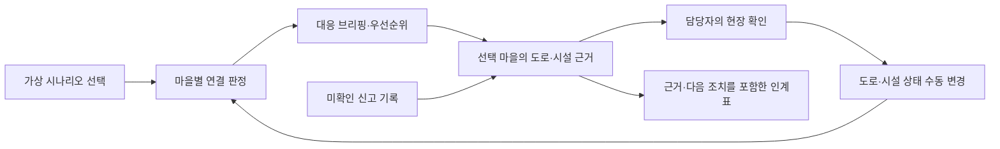

# Bangkok 레퍼런스 분석과 운산면 적용

확인일: 2026-10-01. 대상 사용자는 운산면 호우 비상근무 담당자 한 명이다. 관심 질문은 “어느 마을의 연결을 먼저 확인하고, 무엇을 근거로 다음 근무자에게 넘길까?”다.

## 직접 확인한 구성

| 참고 사이트의 구성 | 확인한 동작·한계 | 운산 연결지도 반영 |
| --- | --- | --- |
| AVOID 우선순위 | 악화·개선·신규 상태와 공식 발표를 구분한다. 자체 순위가 공식 경보는 아니다. | 연결 확인 불가 → 추가 확인 → 연결 경로 있음 순서. 같은 상태에서는 미확인 신고가 많은 마을을 먼저 표시한다. |
| K.A.R.A 상황 요약 | 여러 출처를 요약하며 누락된 출처도 표시한다. 독자적인 수문 예측 모델로 해석할 수 없다. | 입력한 도로·시설 상태를 규칙으로 정리하는 대응 브리핑과 다음 확인 행동. 외부 AI 사용으로 표현하지 않는다. |
| 레이어별 갱신 시각 | 수위·강우·SOS·대피소 등 출처마다 자료 시각이 다르다. 단일 LIVE 표기로는 충분하지 않다. | 경로를 구성하는 도로·시설별 훈련 확인 시각과 출처 표시. 미확인은 판단 보류, 30분 초과는 재확인 필요. |
| 시민 제보 레이어 | 제보와 공식 자료를 함께 보지만 성격과 신뢰도를 구분한다. | 마을별 미확인 신고 수를 지도 배지에 표시. 신고 저장·확인 완료는 도로 상태를 자동 변경하지 않는다. |
| 이전 시점 대비 변화 | 우선순위의 변화와 현재 상황을 함께 보여준다. | 이전 기본 시나리오와 현재 입력값을 비교. 실제 관측 이력이나 예측으로 표현하지 않는다. |
| 3D / 2D와 레이어 | `/3d/`는 Three.js 기반 브리핑 화면, `/m/`는 지도와 정보 패널 중심이다. | 기존 MapLibre 2D/3D를 유지하고 현장 확인·연결 분석·지형 개관 표시 구성을 제공한다. |

## 구현한 업무 흐름

### 데이터 해석 규칙

- 배경지도·고도 자료 외의 운영 데이터는 가상이다. 시설 A–C는 실제 지정 대피시설이 아니다.
- `06:00`, `06:30`, `07:00`은 훈련 시각이다. 기본 확인값은 해당 시나리오 5분 전, 수동 상태 변경은 해당 시나리오 시각으로 기록한다. 실제 경과 시간으로 자동 갱신하지 않는다.
- 확인 시각이 30분을 넘으면 재확인을 안내하지만 연결 판정을 임의 변경하지 않는다. 실제 운영용 유효기간 기준은 현장 검증이 필요하다.
- 비교 기준은 **이전 시나리오의 기본 상태**다. 이전 화면에서 사용자가 수정했던 값이나 실시간 관측 이력이 아니다.
- 신고는 모든 시나리오의 미확인 기록을 합산하며, 기록 목록에서 접수 당시 시나리오를 표시한다. 위치 미확정 신고는 전체 대기에 포함하고 지도 마을에는 배치하지 않는다.
- 지도 배지는 신고 위치를 정확히 측정한 좌표가 아니라 선택된 시연 마을에 묶은 건수다.
- “확인 완료”는 신고 처리 기록이고 “검토 기록”은 마을 판단의 검토 이력이다. 개별 도로·시설의 확인 시각은 상태 변경 또는 “같은 상태로 재확인”으로 갱신한다. 미확인 항목에는 재확인 버튼을 제공하지 않는다.

## 참고 출처

- [Bangkok 모바일 지도](https://situational-bangkok-flood.web.app/m/): AVOID, LAYERS, HELP, K.A.R.A, SOURCES와 현장 제보 UI.
- [Bangkok 3D 화면](https://situational-bangkok-flood.web.app/3d/): 3D 화면, 내장 2D 정보 패널, 출처·한계 안내. 공식 경보가 아니라 상황 파악용이라는 설명을 확인했다.
- [통합 데이터](https://situational-bangkok-flood.web.app/live.json): 수위·강우·SOS·대피소 등 서로 다른 출처의 통합 구조.
- [출처 상태](https://situational-bangkok-flood.web.app/health.json): 수집 실패와 지연 상태를 별도로 노출한다.
- [K.A.R.A 요약](https://situational-bangkok-flood.web.app/kara.json): 요약 시각, 사용 모델, 건너뛴 출처를 포함한다.

화면 구성과 정보 설계 원칙을 참고했으며 참고 사이트의 소스 코드나 데이터를 앱에 복제하지 않았다. 실시간 강우·수위 연계, 실제 도로 폐쇄와 지정 시설 자료, 신고 위치 검증, 기관 인계는 다음 개발 단계다.
