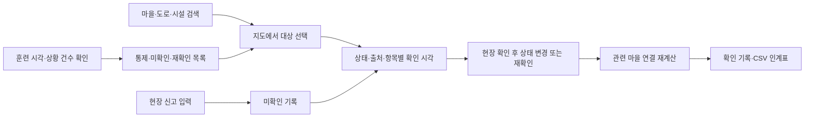

# 방콕 홍수 지도 UX/UI 분석과 운산 연결지도 적용

작성: 2026-10-02 · 분석 대상: 사용자가 첨부한 화면 4장

## 1. 어떤 유형의 화면인가

**지도 중심의 재난 상황 인지 대시보드**다. GIS(지리정보시스템)에 운영 현황, 현장 신고, 관측 정보와 확인 작업을 겹쳐 보여준다. 사용자는 ‘어디에 문제가 있는가 → 근거가 무엇인가 → 다음에 무엇을 확인할 것인가’ 순서로 이동한다.

첨부 이미지는 화면에 보이는 구성과 표현을 분석하는 근거다. 화면 속 AI·실시간·수심·관측 수치의 정확도나 실제 연결 여부, 보이지 않는 클릭 동작은 이미지로 확인할 수 없다. 아래 개선안은 그 구분을 전제로 한다.

운산 연결지도의 주 사용자는 **호우 상황에서 여러 마을의 진입로와 시설 개방 여부를 확인하고 다음 근무자에게 인계하는 읍면 비상근무 담당자**로 잡았다. 고령 주민에게 모든 지도 정보를 직접 조작하게 하기보다, 담당자가 확인할 대상을 좁히는 데 초점을 맞춘다. 현재 마을 A–D와 운영 데이터는 가상 시연이다.

## 2. 이미지 1: 많은 제보와 위험이 겹친 광역 상황 지도

| 요소 | 화면에서 보이는 방식 | 사용 목적과 주의점 | 운산 적용 |
|---|---|---|---|
| 전면 지도 | 화면 대부분을 지도가 차지 | 위치 관계를 한눈에 파악. 표식이 과하면 지형·도로를 가린다 | 지도 중심 배치, 데스크톱 ‘지도 넓게’ |
| 빨강·주황·노랑 점 | 다수의 점을 위험 색상으로 표현 | 빠른 분류에 유리하지만 범례 없이는 의미가 불명확 | 통제는 적갈색, 미확인은 황갈색. 문자·아이콘 병행 |
| 집 아이콘과 반경 | 초록 원과 집 모양 | 시설 위치·영향권처럼 보인다. 반경의 근거가 필요 | 시설 아이콘만 사용. 검증되지 않은 서비스 반경은 생성하지 않음 |
| 점선 원과 숫자 | 여러 표식이 수량으로 묶임 | 겹침 감소. 숫자가 신고 수인지 시설 수인지 명시해야 함 | 미확인 신고만 마을별 배지로 합산. 건물 수·피해자 수와 구분 |
| AVOID 표식 | 위험 구역에 행동 문구를 띄움 | 행동을 빠르게 유도하지만 근거 없는 우회 지시는 위험 | ‘통제/미확인’ 표식 → 도로 상세 → 확인 및 상태 기록 |
| 수심 말풍선 | 100cm, 허리·가슴 높이 같은 표현 | 숫자를 체감 정보로 바꿈. 관측 위치·시각·오차 확인이 필수 | 수심 자료가 없어 표시하지 않음. 대신 상태·훈련 확인 시각 표시 |
| Official / Reports & AI / Both | 출처 성격별 보기 전환 | 관측·제보·추론의 혼동을 줄임 | ‘전체 / 상황 근거 / 미확인 신고’ 필터 |
| 강우 레이더 범례 | 색상띠와 관측 시각, ‘침수 아님’ 안내 | 강우와 지표 침수를 구분 | 푸른 면에 ‘가상 영향 범위 · 수심 아님’ 명시 |
| AI 이름의 반복 라벨 | 동일 라벨이 다수 중첩 | 출처는 보이지만 화면을 가리고 실제 정확도는 알 수 없음 | 반복 브랜드 라벨 대신 선택한 항목의 근거 카드 사용 |
| 하단 출처 | 지도·데이터 제공자 표시 | 데이터 계보·이용 조건 확인 | 기존 지도·건물 출처 유지, 별도 자료 안내 제공 |

**개선 판단:** 이 화면의 장점은 다양한 정보를 위치에 연결하는 능력이다. 운산에서는 데이터 종류와 수량에 맞춰 밀도를 낮춘다. 네 마을의 표식에 허구의 군집 수를 붙이지 않고, 실제 저장된 신고 수만 표시한다.

## 3. 이미지 2: 도시 전체를 보는 3D 운영 화면

| 요소 | 화면 분석 | 운산 적용과 이유 |
|---|---|---|
| 상단 2단 헤더 | 검색·시점·센터·설정과 상태·날씨·갱신 시각을 분리 | 첫 줄은 브랜드·검색·인계표, 둘째 상황줄은 훈련 시각·도로 통제·미확인 근거·재확인·신고 대기 |
| 기울어진 지도 | 도시 구조와 도로 연결을 공간적으로 표현 | 기존 2D/3D 시점·실제 지형 유지. 연결 검토 시 2D도 선택 가능 |
| 수로 수위 % 카드 | 광역 지도를 보면서 핵심 관측값 비교 | 수위 대신 현재 입력된 도로·시설의 상태와 확인 시각을 연결 |
| 도로·행정구역 강조 | 이동 축과 구역 단위로 시선 유도 | 시연 도로망과 선택 도로의 외곽선을 구분 |
| 여러 시설 아이콘 | 시설 종류별 시각적 구분 | 마을 문자 A–D, 시설 집 모양, 통제 X, 미확인 경고 삼각형 |
| 지역명 크기 차이 | 광역·세부 지명의 위계 | 배경 지명의 기본 확대 단계 유지, 업무 표식의 이름은 확대·선택 시 강조 |
| 지도 조작 도구 | 확대·축소·방향·전체 보기 | 기존 도구 유지, 북쪽 화살표가 회전에 맞춰 변화 |
| 넓은 정보 면적 | 한 화면에 여러 종류의 정보 표시 | 데스크톱에서는 목록과 지도, 모바일에서는 목록/지도 전환으로 공간 확보 |

**고도화 포인트:** 상단 숫자가 단순 장식으로 끝나지 않는다. ‘도로 통제 2구간’을 누르면 해당 2개 구간만 목록에 나오고, 다시 선택하면 도로 상세로 이동한다. ‘미확인 근거’는 도로와 시설을 합산하며, 동일 도로가 여러 마을 경로에 등장해도 한 번만 센다.

## 4. 이미지 3: 근거리의 건물·시설·위험 확인

1. **건물의 윤곽과 높이**는 밀집도와 시야를 이해하는 배경이다. 실제 높이가 없는데 임의로 높이면 물리적 위험 판단에 잘못된 인상을 줄 수 있다. 운산은 기존 공개자료 수록 건물 도형 전체를 유지하고, 높이를 제공받지 않은 상태에서는 윤곽으로 표시한다. 층수는 클릭 정보에 표시하되 임의 높이로 환산하지 않는다.
2. **지도 위 말풍선**은 위치와 내용을 연결한다. 운산에서는 통제·미확인·30분 초과 재확인 구간을 버튼으로 표시하고, 도로 상세에서 상태·출처·확인 시각·체크리스트를 제공한다.
3. **시설 아이콘**은 종류를 구분한다. 운산의 시설 3곳은 실제 지정 대피소가 아닌 시연 시설이라는 설명을 유지한다.
4. **저배율과 고배율의 정보량 차이**가 필요하다. 광역 화면에서는 짧은 상태와 마을 문자, 확대하면 이름을 보여준다. 선택·키보드 포커스·마우스 호버 시 상세 표식을 드러낸다. 건물 도형 자체를 샘플링하거나 삭제하는 방식으로 밀도를 줄이지 않는다.
5. **선택 상태**는 색상 외에도 테두리로 표현한다. 도로를 선택하면 별도 외곽선과 근거 카드가 함께 나타나 현재 살펴보는 대상을 구분한다.

## 5. 이미지 4: 헤더의 역할 분리

- **브랜드:** 서비스와 지역을 짧게 식별한다. 운산에서는 ‘운산 연결지도’를 유지한다.
- **검색:** 지도를 움직이기 전 이름으로 목적지를 찾는다. 현재 검색 대상은 등록된 시연 마을·도로·시설이다. 실주소 전체 검색처럼 오해하지 않도록 결과창에 검색 범위를 표시한다.
- **시점 조작:** 2D/3D와 전체 보기는 지도에 가까이 배치한다.
- **상황 시각:** 실제 현재 시계와 훈련 시나리오 시간을 섞지 않는다. 운산에서는 ‘훈련 06:30’을 명시한다.
- **갱신 상태:** 하나의 ‘업데이트됨’ 배지로 모든 항목이 최신인 듯 표현하지 않는다. 도로·시설별 확인 시각을 제공하고, 30분 초과 근거만 재확인 대상으로 센다.
- **환경 값:** 실제 연동되지 않은 온도·풍속·수위·AI 신뢰도 숫자는 만들지 않는다.
- **지도 중심:** 현재 지도 중심 좌표임을 명시한다. 사용자의 GPS 위치로 표현하지 않는다.

## 6. 흰색 테마로 옮긴 시각 체계

| 역할 | 색상 | 적용 |
|---|---|---|
| 기본 면 | `#FFFFFF` | 헤더, 목록, 상세 카드 |
| 보조 면 | `#F3F6FA` | 구획, 입력창, 요약 |
| 주요 글자 | `#172B3A` | 제목·숫자·선택 필터 |
| 연결·확인 | `#087F80` | 확인된 연결, 주요 버튼 |
| 통제 | `#BD452B` | 통제 선·상태·X 표식 |
| 미확인 | `#8C6500` | 미확인 선·경고 표식 |
| 지리 배경 | 저채도 녹색·푸른색 | 지형·물길·가상 영향 범위 |

색만으로 상태를 구분하지 않는다. 통제에는 X와 텍스트, 미확인에는 삼각형과 점선, 시설에는 집 모양을 같이 사용한다. 새로운 컨트롤은 14px, 보조 설명은 12px를 기본으로 한다. 지도를 장식적인 어두운 관제실 화면으로 바꾸기보다 흰색에서 읽히는 대비를 우선한다.

## 7. 구현한 사용 흐름

신고를 저장하는 행위와 도로 상태를 확정하는 행위는 분리한다. 신고는 마을 단위로 모으며, 위치 미확정 신고는 목록에 남긴다. 출처 필터는 화면 표시만 바꾸고 원래 상태나 기록을 수정하지 않는다. 레이어 체크박스의 선택도 유지한다.

## 8. 지금의 구현 범위와 다음 데이터 연결 조건

**반영:** 상단 상황줄, 클릭 가능한 상황 집계, 범위가 명확한 검색과 키보드 조작, 출처 필터, 통제·미확인 표식, 개별 도로 상세, 선택 구간 강조, 확대 단계별 표식 밀도, 지도 넓게 보기, 중심 좌표, 동적 범례, 모바일 지도/목록 흐름.

**유지:** 실제 공개 지형·건물 윤곽, 가상 마을·도로·시설 시나리오, 수동 확인·신고 기록, 연결 계산, CSV 인계. 건물 완전성은 공개 서비스가 반환하는 원본 ID와 일치하는지를 검증하는 범위다. 원본의 갱신 지연 때문에 현존 건물 전체를 보장한다는 뜻은 아니다.

**자료가 필요한 다음 단계:** 관측기관 수위·강우 API, 공식 통제 구간, 실제 지정 대피시설과 개방 확인 체계, 신고 위치·사진·시각의 검증 절차, 실제 도로 연결망. 이 자료가 확보된 뒤 수심·실시간·AI 결과를 각각 출처와 오차를 포함해 연결한다.

참고 화면 원본 서비스: [Bangkok flood map](https://situational-bangkok-flood.web.app/m/). 이번 문서의 세부 화면 분석은 사용자가 제공한 4장의 이미지에 근거한다.

구현 참고: [MapLibre 카메라 범위 옵션](https://maplibre.org/maplibre-gl-js/docs/API/type-aliases/CameraForBoundsOptions/)에 따라 전체 보기 전에 기존 카메라 여백을 초기화한다. 검색·화면 크기 전환 뒤 전체 보기를 반복해도 여백이 누적되지 않도록 했다.
